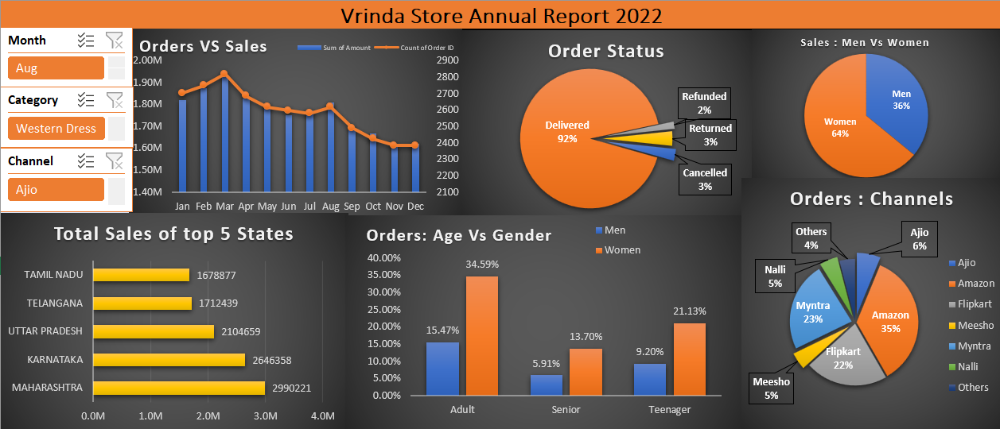

# Vrinda Store Sales Analysis & Dashboard

## 📊 Project Overview

This project is an end-to-end sales data analysis of Vrinda Store using Microsoft Excel.

I worked on the complete process starting from raw data cleaning and processing to data analysis, visualization and dashboard creation.

The main purpose of this project was to understand sales performance, customer behaviour, order status and sales channels and present the findings through an interactive dashboard.

---

## 🎯 Project Objectives

The project was created to answer the following questions:

- How do sales and orders change month by month?
- Which gender contributes more to sales?
- Which age group contributes the most orders?
- Which states have the highest sales?
- Which sales channels receive the most orders?
- What is the order status distribution?
- Which categories and channels perform better?

---

## 🔄 Project Workflow

### 1. Data Cleaning

I started with the raw dataset and cleaned the data before beginning the analysis.

### 2. Data Processing

The cleaned data was prepared and organized for further analysis.

### 3. Data Analysis

I analyzed the data based on:

- Monthly sales and orders
- Order status
- Gender
- Age groups
- States
- Sales channels
- Categories

### 4. Dashboard Creation

I created an interactive Excel dashboard using:

- Pivot Tables
- Pivot Charts
- Slicers
- Excel formulas and functions
- Data visualization

The dashboard includes filters for:

- Month
- Category
- Channel

---

## 📈 Dashboard

The final dashboard is called **Vrinda Store Annual Report 2022**.

It includes:

- Orders vs Sales
- Order Status
- Sales: Men vs Women
- Top 5 States by Sales
- Orders: Age vs Gender
- Orders by Sales Channels

---

## 💡 Key Insights

### 1. Women vs Men Sales

Women contributed around **64% of total sales**, while men contributed around **36%**.

### 2. Order Status

Around **92% of orders were delivered**.

The remaining orders were returned, cancelled or refunded.

### 3. Top 5 States by Sales

The top 5 states based on sales were:

1. Maharashtra
2. Karnataka
3. Uttar Pradesh
4. Telangana
5. Tamil Nadu

### 4. Age Group

The **Adult age group (30–49 years)** contributed around **50% of the orders**.

### 5. Sales Channels

The largest sales channels by order contribution were:

- Amazon – 35%
- Myntra – 23%
- Flipkart – 22%

---

## 📌 Final Recommendation

Based on the analysis, women customers aged **30–49 years** were an important customer group in the dataset.

Maharashtra, Karnataka and Uttar Pradesh were among the top-performing states by sales.

Based on these findings, one possible approach to improve sales would be to focus marketing efforts on women customers in the 30–49 age group in these major states.

Products can also be promoted through major channels such as **Amazon, Myntra and Flipkart**.

---

## 🛠️ Tools Used

- Microsoft Excel
- Pivot Tables
- Pivot Charts
- Slicers
- Excel Formulas and Functions
- Data Cleaning
- Data Processing
- Data Analysis
- Data Visualization

---

## 📁 Project Files

- `Vrinda Store Data Analysis.xlsx` – Complete Excel project containing the raw data, analysis and dashboard.
- `vrinda-store-dashboard.png` – Final dashboard screenshot.

---

## 📌 What I Learned

Through this project, I practiced the complete data analysis process in Excel, starting from raw data and going through data cleaning, processing, analysis and visualization.

I also learned how to use Excel to turn a large dataset into a simple dashboard and explain the main findings from the data.
